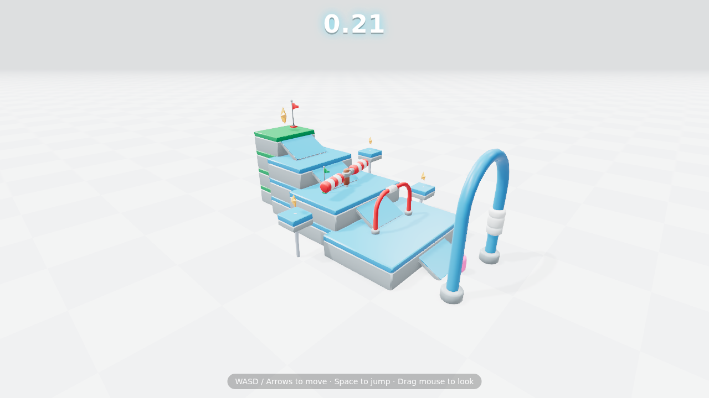
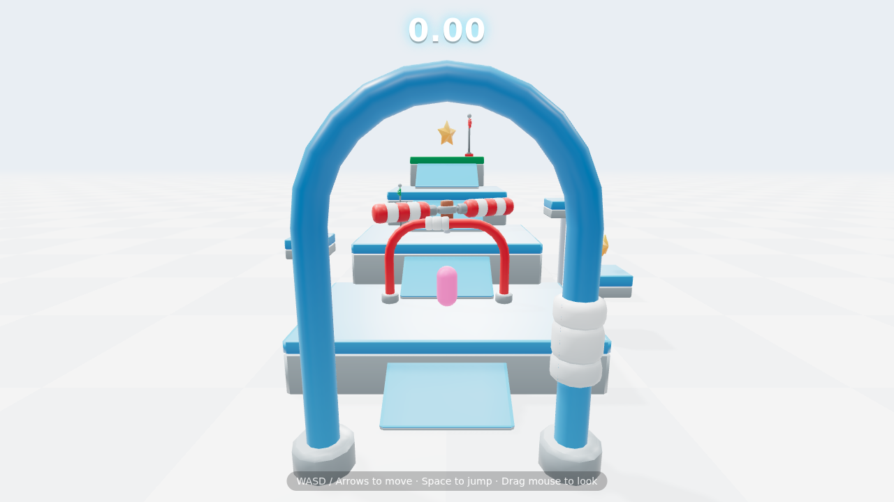
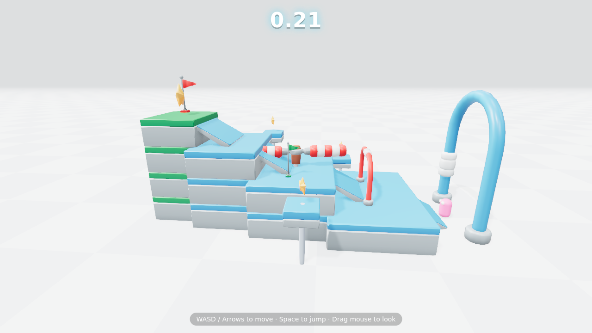
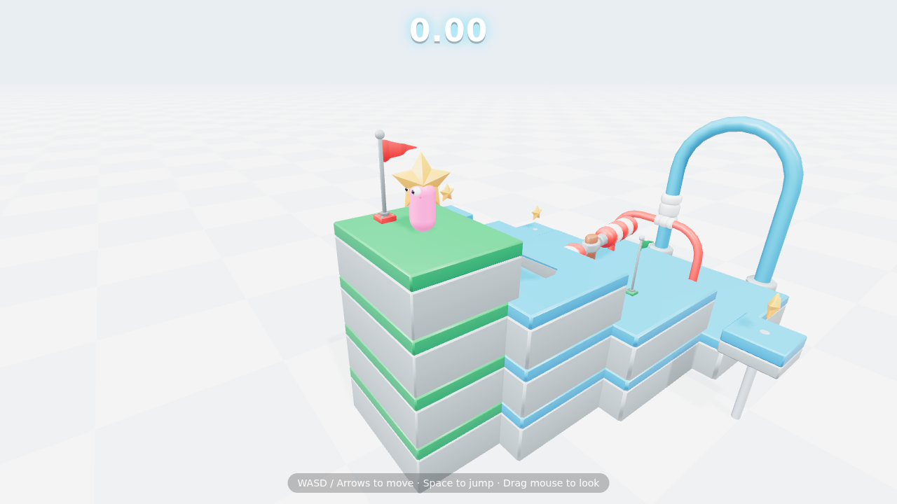

# 💊 Pill Guys

A chaotic, **Fall Guys-style** physics party platformer that runs in the
browser — plus a companion **Solana token (PILL)** scaffold.

Wobble your little pill through a winding, elevated obstacle course — dodge
spinning beams, survive conveyor belts, ride moving platforms, time the spike
rollers, climb the ramp, hit the checkpoints, and grab the crown to qualify.

### Obstacles in the course

Modular obstacle classes live in [`src/obstacles.js`](./src/obstacles.js):

| Obstacle | Behaviour |
| -------- | --------- |
| **Spinning beam** | Sweeps a horizontal circle; touch = respawn |
| **Conveyor belt** | Pushes whatever stands on it (run against it!) |
| **Moving platform** | Kinematic platform that carries you as it slides |
| **Spike roller** | Spiked drum rolling across the path — jump it |
| **Ramp** | Angled surface up to the high tier |
| **Gears / tube arches / gates** | Decorative KayKit-style flavour |

The course itself is assembled declaratively in [`src/Level.js`](./src/Level.js),
so adding or rearranging sections is straightforward.

> Fresh-start foundation: a polished, playable prototype you can build a full
> game on. Not a finished product (yet).

## Screenshots



| Front terraces | Stacked tiles | The summit |
| --- | --- | --- |
|  |  |  |

_A stacked-tile voxel structure in the KayKit style — terraces at changing
elevations connected by slopes, climb to the crown — built from the bundled
KayKit Platformer Pack (EXTRA) models (CC0). On a real GPU it also renders with
GTAO ambient occlusion + SMAA._

## Tech

- **[Three.js](https://threejs.org/)** — 3D rendering
- **[Rapier](https://rapier.rs/)** (`@dimforge/rapier3d-compat`) — physics &
  kinematic character controller
- **[Vite](https://vitejs.dev/)** — dev server & bundler
- **[@solana/web3.js](https://solana.com/) + SPL Token + Metaplex** — the token
  scaffold in [`token/`](./token)

## Run the game

```bash
npm install
npm run dev        # open the printed localhost URL
```

Build for production:

```bash
npm run build      # outputs to dist/
npm run preview
```

### Controls

| Action | Keys |
| ------ | ---- |
| Move   | `W A S D` / Arrow keys |
| Jump   | `Space` |
| Camera | Drag mouse (orbit) · Scroll (zoom) |

## Art assets (KayKit)

The real **KayKit Platformer Pack (EXTRA)** models (CC0) are now **bundled** in
[`public/models/kaykit/`](./public/models/kaykit) — organized into color
subfolders (`blue/`, `green/`, `red/`, `yellow/`, `neutral/`, each with its
`platformer_texture.png`). They're loaded at runtime via
[`src/Assets.js`](./src/Assets.js); if any model fails to load, the game
gracefully falls back to built-in primitive shapes, so it stays playable.

Credits and licensing: see [`CREDITS.md`](./CREDITS.md).

## The PILL token

A **scaffold-only** Solana token lives in [`token/`](./token). It defaults to
**devnet** and refuses to touch mainnet without an explicit
`CONFIRM_MAINNET=yes`. Nothing deploys until you run it. See the
[token README](./token/README.md).

```bash
cd token && npm install && npm run create-token   # devnet by default
```

## Project structure

```
.
├── index.html              # game shell + HUD/overlays
├── src/
│   ├── main.js             # bootstrap
│   ├── Game.js             # scene, lights, loop, state machine
│   ├── PhysicsWorld.js     # Rapier wrapper
│   ├── Player.js           # pill + kinematic character controller
│   ├── Level.js            # assembles the winding course
│   ├── obstacles.js        # beams, conveyors, moving platforms, rollers, props
│   ├── FollowCamera.js     # orbit/zoom follow camera
│   ├── Assets.js           # GLTF loader + KayKit manifest
│   ├── Input.js            # keyboard
│   ├── Hud.js              # DOM overlays
│   └── config.js           # gameplay tuning
├── public/models/kaykit/   # bundled KayKit Platformer Pack EXTRA models
│   │                        #   (blue/ green/ red/ yellow/ neutral/ + LICENSE.txt, CC0)
└── token/                  # Solana PILL token scripts (scaffold)
```

## Roadmap ideas

- Real KayKit models for player, hammers, platforms
- More obstacle types (swinging axes, push bars, see-saws, wrecking balls)
- Multiplayer races (WebRTC / authoritative server)
- Skins / cosmetics gated by holding PILL
- Leaderboards with on-chain time attestations

## License

Game code: MIT (see below). KayKit assets: CC0. See [`CREDITS.md`](./CREDITS.md).
